 
 

> 삼성 청년 소프트웨어 아카데미(SSAFY) 10기 2학기 자율 프로젝트 (A309)

🗓 **기간** : 2024.04.08 ~ 2024.05.17 
✨ **주제** : 미션과 보상을 통한 우리 아이 습관 형성 서비스 

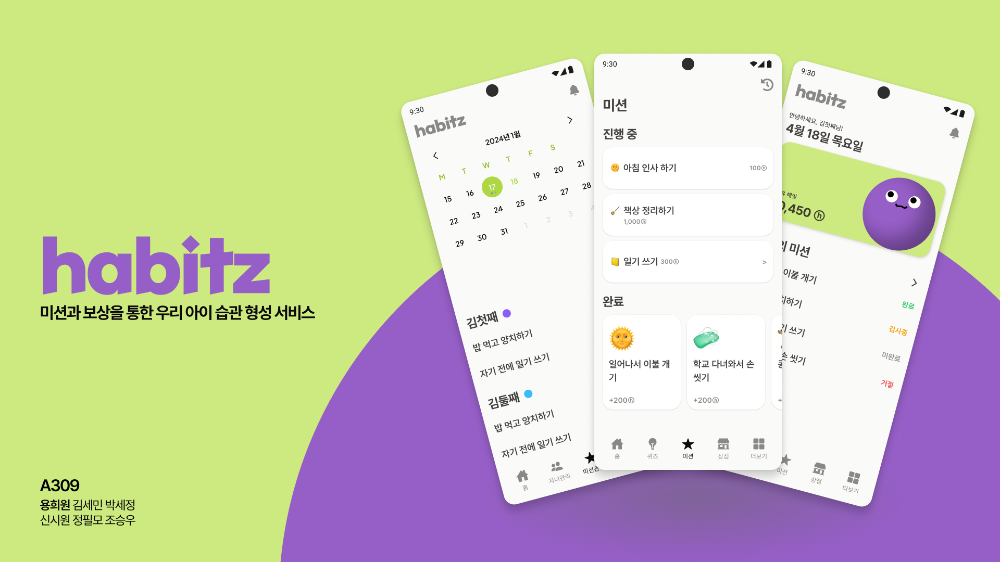

 
 

  <a href="https://habitz.space/" > 🔗 HABITZ 서비스 구경가기 🔗</a>

 

  <h3>📖 문서</h3> 
  
  

    <a href="https://www.notion.so/HABITZ-ac41f48516f24bad9cff4386a8c54eaf?pvs=4">📝 노션</a>
    &nbsp; | &nbsp; 
    <a href="https://www.figma.com/design/aJZaMvbtvu57ejhOw3IKJ9/%EC%9E%90%EC%9C%A8%ED%94%84%EB%A1%9C%EC%A0%9D%ED%8A%B8-%ED%8E%98%EC%9D%B4%EC%A7%80-%EB%94%94%EC%9E%90%EC%9D%B8?node-id=313-1395&t=MqiCoiZSxAcLoZR9-0">🎨 피그마</a>
    &nbsp; | &nbsp; 
    <a href="https://drive.google.com/file/d/1nyt7GHdQUHWAqIWrXtTtzPrb85hdpjOu/view?usp=sharing">💁 발표자료</a> &nbsp;
    | &nbsp; 
    <a href="https://drive.google.com/file/d/1M5uyH9CUrLz_8ZDjxo-iAyQxdl8FpJ2g/view?usp=sharing">🎥 UCC</a>
    &nbsp;
  

---
### 📢  프로젝트 소개
미션과 보상을 통한 우리 아이 습관 형성 서비스
`#앱테크` `#용돈관리` `#가족` `#금융` `#생활`
> 미션과 보상을 통해 자녀의 올바른 습관 형성에 기여하고, 부모의 투명하고 체계적인 자녀 용돈 관리를 돕는 서비스

Habitz는 미션과 보상을 통해 자녀의 올바른 습관 형성을 만들어주기 위해 탄생한 서비스입니다.
부모는 아이에게 좋은 습관을 형성하는데 기여하고 용돈을 부여하여 체계적으로 자녀의 활동을 관리할 수 있습니다.
또한 스마트폰이 익숙한 ZALPHA 세대 자녀는 부여된 미션을 하나씩 수행해나가며 용돈을 벌고, 기초 경제 관념을 배워나갑니다.

----
### 

## 🌈 서비스 화면 및 기능

> HABITZ는 부모와 아이 2개의 역할로 구분되어 있습니다.

### 👩‍❤️‍👨 Parent

| 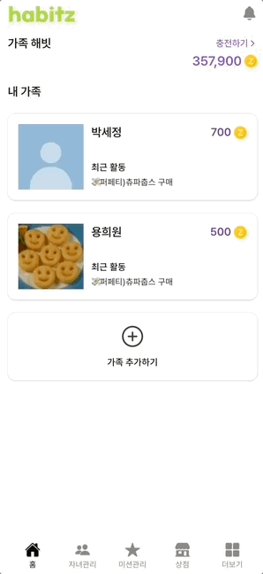 | 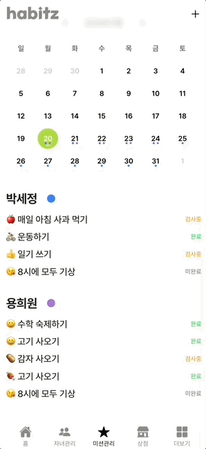 | 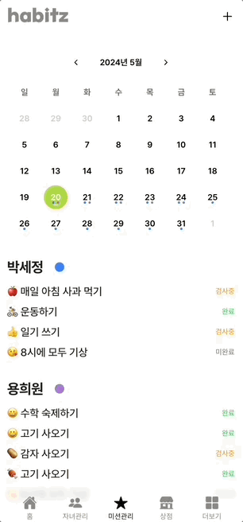 |
| :------------------------------------: | :----------------------------------------: | :-------------------------------------------: |
|                홈 화면                 |                미션 관리                 |                   미션 승인                  |

| 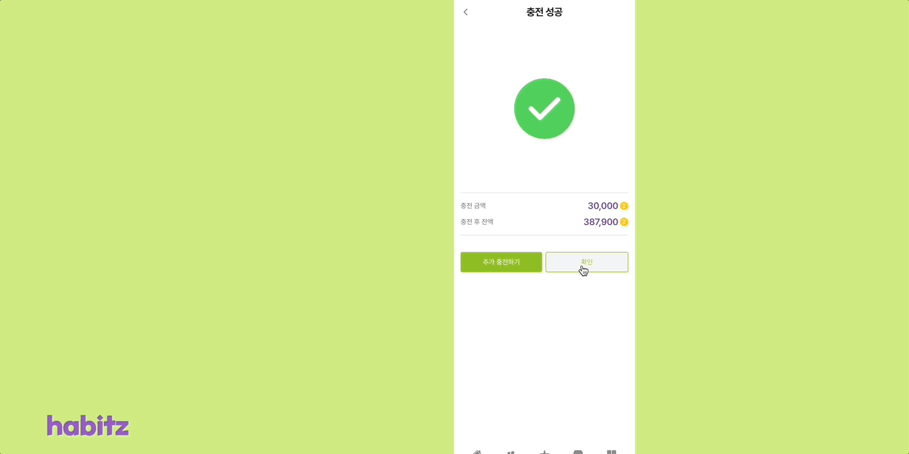 | 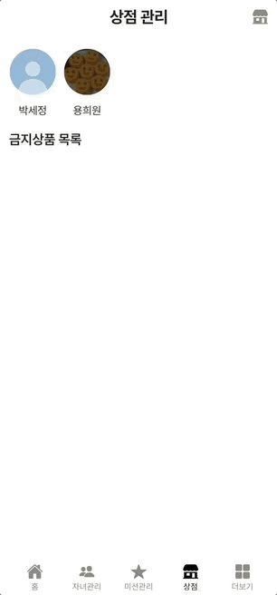 
| :---------------------------------------------------: | :---------------------------------------------------: | 
|                      포인트 충전                       |상점 관리|

#### ❤︎ 미션을 통해 아이의 습관을 형성해보세요

일회성 혹은 정기적 미션을 생성하여 자녀에게 미션을 부여하고, 캘린더를 통해 여러 자녀들의 미션을 한눈에 관리해요.

#### ❤︎ 아이에게 용돈을 줄 포인트를 충전해요

토스 페이먼츠를 통해 가족 공용 포인트를 충전해요.
가족 공용 포인트는 자녀가 상품을 구매할 때 사용됩니다.

#### ❤︎ 자녀의 행동을 모니터링 해요

자녀의 미션 인증, 구매 내역 등 활동과 소비 패턴을 히스토리를 통해 모니터링 해요.
또한 아이가 상점에서 특정 상품을 구매할 수 없도록 금지 상품 목록을 관리합니다.

 

### 👼 Child

| 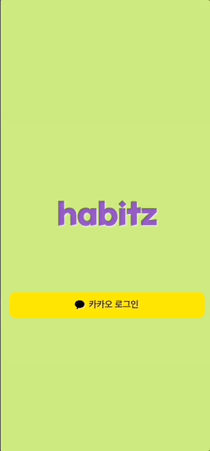 | 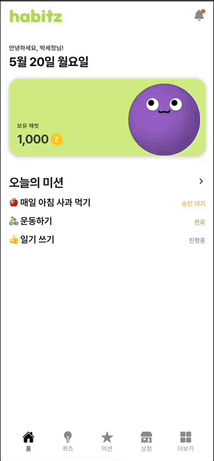 | 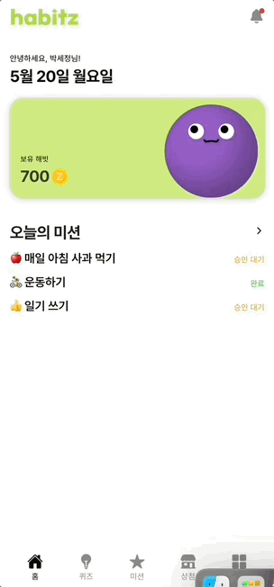 |
| :------------------------------------: | :----------------------------------------: | :-------------------------------------------: |
|                홈 화면                |                미션과 인증                  |                   알림 확인                 |

| 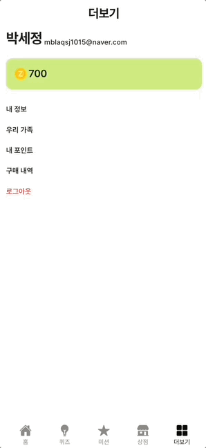 | | 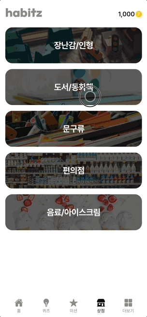 |
| :---------------------------------------------------: | :-------------------------------------: | :-------------------------------------------: |
|                      마이페이지                       |                 퀴즈                 |                   상점                   |

#### ❤︎ 미션을 수행하며 용돈을 벌어볼까요?

스마트폰이 더 익숙한 ZALPHA 세대, 앱테크로 용돈을 벌고 자립심을 키워요!

#### ❤︎ 내가 번 용돈으로 상품을 구매해요!

미션을 하나씩 해결해나가며 모은 용돈으로 원하는 상품을 구매할 수 있어요.

#### ❤︎ 퀴즈를 통해 금융 상식과 생활 지식을 쌓아나가요

매일 부여되는 OX 퀴즈를 통해 아이에게 도뭄이 되는 기사를 읽어요.
또한, 퀴즈 관련 기사 글를 통해 금융/생활/기초 지식을 키워나갑니다. 

---

## 🛠 기술 스택 

| Frontend | Backend | Infra | 
| :----:| :----:| :----:|
| 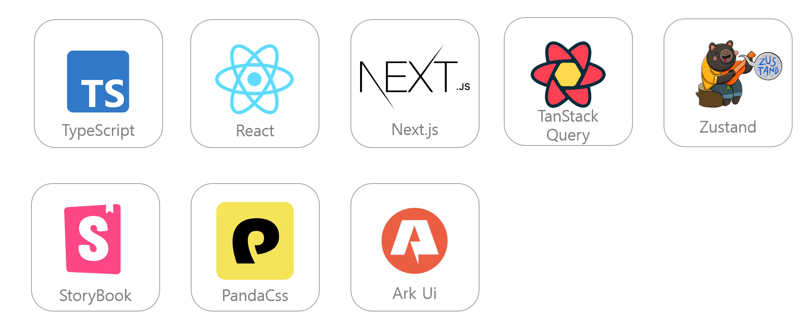 | 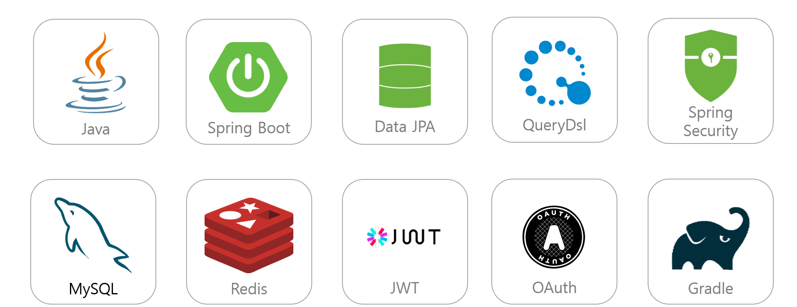 | 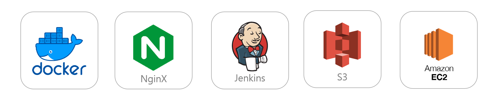|

### ✅ 구현 사항
<il>
    <li>Design System과 StoryBook을 활용하여 높은 재사용성과 통일성이 높은 프론트엔드 개발</li>
    <li>스케줄러를 활용하여 주기적으로 미션 이벤트 발생</li>
    <li>토스 페이먼트를 활용한 결제 시스템 구현</li>
    <li>OAuth 기반 소셜 로그인</li>
    <li>S3를 활용하여 파일 업로드 구현</li>
</il>

----

## ⚙️ 시스템 구성도

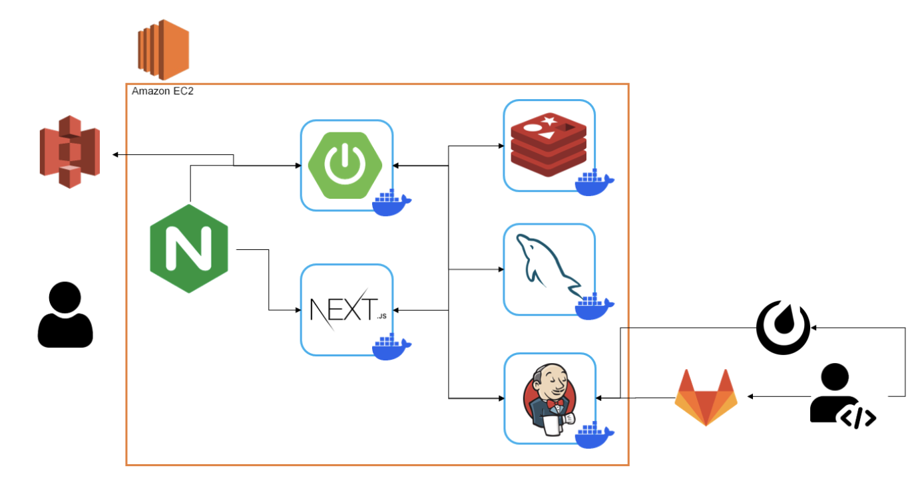

## 💾 ERD 구성도 
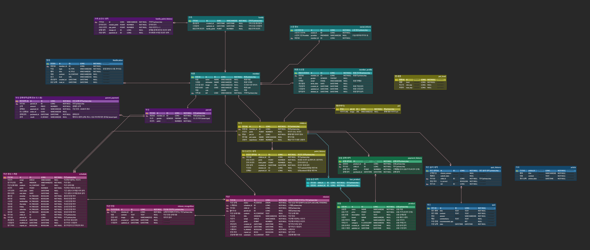

----
### 👥 Team

|  |   |   |   |   | | 
| :---------------------------------------------------: | :-------------------------------------: | :-------------------------------------------: |:---------------------------------------------------: | :---------------------------------------------------: | :---------------------------------------------------: |
|                      [👑 용희원](https://github.com/heecircle)                     |                 [정필모](https://github.com/itsmo1031)                 |                   [김세민](https://github.com/kimgiraffe)                   |  [신시원](https://github.com/tooyul) |  [박세정](https://github.com/sejeong-park) | [조승우](https://github.com/KrswJo) |
|PM Frontend Backend| Frontend Infra Design| Frontend Design | Frontend| Backend| Backend | 

## 🙋🏻‍♀️ Role

### 용희원
- [BE] 결제 및 포인트 API 구현
- [BE] 상점 API 구현
- [BE] 퀴즈 API 구현
- [FE] 부모 상점 관리 페이지 구현
- [FE] 개인정보 수정 페이지 구현

### 정필모
- [Infra] Infra/DevOps 
- [Design] 디자인 시스템 구축
- [FE] 회원 파트 구현
- [FE] 알림 페이지 구현

### 김세민
- 결제 페이지 구현
- 자식 메인 페이지 구현
- 미션 수행 페이지 구현
- 포인트 내역 페이지 구현
- 퀴즈 페이지 구현
- 구매 내역 페이지 구현
        

### 신시원
- 미션 생성/수정/삭제 기능 구현
- 부모의 자녀 관리 페이지 구현
- 부모 메인 페이지 구현

### 박세정
- 스케쥴링 API 구현
- 미션 API 구현
- 퀴즈 API 구현
- 알림 기능 구현
- 상점 및 기사 정보 크롤링

### 조승우
- 회원 관리 API 구현
- KaKao 소셜 로그인 구현
- 알림 API 구현
